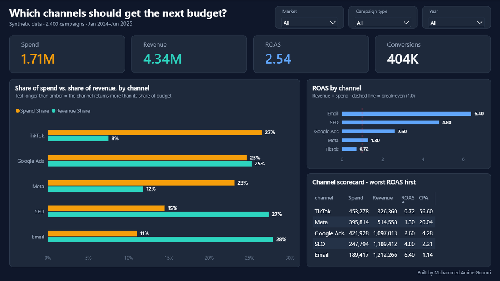

# Which channels should get the next budget?

**Marketing channel ROI analysis in Power BI, by Mohammed Amine Goumri**



Cut TikTok. It takes 27% of spend and 8% of revenue, ROAS 0.72. Cap Meta until prospecting is split from retargeting, ROAS 1.30. Move the next test budget to Email and SEO. They produce about half of revenue on about a quarter of spend.

Data is synthetic, Jan 2024–Jun 2025, 2,400 campaigns. Not a client file. Revenue is last-click in this set, so Email and SEO may be over-credited.

## The question

A marketing team has one more budget to allocate across five channels: Email, SEO, Google Ads, Meta and TikTok. This project answers which channels earn that budget, using a single Power BI page built to support that one decision.

## The data

`data/campaigns.csv` holds 2,400 synthetic campaigns from January 2024 to June 2025, across three markets (Morocco, KSA, UAE) and three campaign types (Prospecting, Retargeting, Always on). Each row has `campaign_id`, `date`, `channel`, `campaign_type`, `market`, `spend`, `impressions`, `clicks`, `conversions` and `revenue`. The data is synthetic and labelled as such; it is not a client file.

## What was built

### 1. Load and type the data

The CSV was loaded into Power BI Desktop with Get data, Text/CSV. Types were checked before applying: `date` as Date, `spend` and `revenue` as Decimal Number, `impressions`, `clicks` and `conversions` as Whole Number.

### 2. Measures (DAX)

```dax
Spend         = SUM(campaigns[spend])
Revenue       = SUM(campaigns[revenue])
ROAS          = DIVIDE([Revenue], [Spend])
Conversions   = SUM(campaigns[conversions])
CPA           = DIVIDE([Spend], [Conversions])
Spend Share   = DIVIDE([Spend], CALCULATE([Spend], ALL(campaigns[channel])))
Revenue Share = DIVIDE([Revenue], CALCULATE([Revenue], ALL(campaigns[channel])))
```

ROAS is formatted to two decimals, both shares as percentages, and Spend, Revenue and Conversions with thousands separators. The measures sit in their own `_Measures` table, because Power BI does not allow a measure to share a name with a column in the same table (`Spend` and `spend`).

A calculated column provides the year slicer:

```dax
Campaign Year = YEAR(campaigns[date])
```

### 3. The "Next budget" page

- **Four KPI cards:** Spend (1.71M), Revenue (4.34M), ROAS (2.54) and Conversions (404K).
- **Share of spend vs. share of revenue by channel:** the decision chart. A channel whose revenue bar is longer than its spend bar returns more than its share of budget. Email is the clearest case; TikTok is the reverse.
- **ROAS by channel:** with a break-even reference line at 1.0. TikTok is the only channel below it.
- **Channel scorecard table:** channel, Spend, Revenue, ROAS and CPA, sorted by ROAS ascending so the weakest channel comes first.
- **Slicers:** market, campaign type and year.

### 4. Design

A custom dark theme, "Marketing ROI Dark" (`powerbi/marketing-roi-dark.json`), keeps colours consistent across the page: amber for spend, teal for revenue and blue for ROAS, on a navy canvas with rounded panels. Every visual has a plain-language title, data labels are on, and gridlines are removed to keep the focus on the comparison.

### 5. Validation

Every figure on the page was checked against an independent calculation of the CSV before the screenshot was taken.

| Channel | Spend share | Revenue share | ROAS | CPA |
|---|---:|---:|---:|---:|
| Email | 11% | 28% | 6.40 | 1.14 |
| SEO | 15% | 27% | 4.80 | 2.21 |
| Google Ads | 25% | 25% | 2.60 | 4.28 |
| Meta | 23% | 12% | 1.30 | 20.04 |
| TikTok | 27% | 8% | 0.72 | 56.60 |

TikTok has the largest spend share and the worst ROAS, which confirms the share measures behave as intended.

## Recommendations

1. **Cut TikTok.** 27% of spend returns 8% of revenue, at 72 cents per dollar and a CPA of 56.60.
2. **Cap Meta.** ROAS 1.30 is barely above cost; split prospecting from retargeting before adding budget, since retargeting can hide a losing prospecting campaign.
3. **Move the next test budget to Email and SEO.** Together they produce about half of revenue on about a quarter of spend.

## Caveats

- Revenue is last-click in this data set, so Email and SEO may be credited with demand that other channels created.
- It is not stated whether TikTok spend includes creator fees or media only.
- The data is synthetic and meant to demonstrate the method, not to describe a real business.

## Repository layout

```
README.md
screenshot.png
data/campaigns.csv
powerbi/marketing-roi-dark.json
```

## Credits

Analysis, data model, DAX measures, dashboard design and recommendations by **Mohammed Amine Goumri**.

© 2026 Mohammed Amine Goumri.
